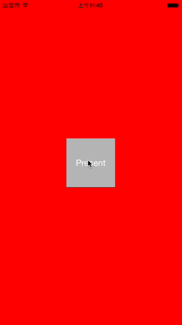

# SawtoothTransitionAnimation

###Screenshot 


Getting Started
===============
##Installation 
Copy all files in `Classes` directory to your project
##Setup manually
Initialization
```objc
@property (nonatomic, strong) SawtoothAnimationController *animator;
@property (nonatomic, strong) GateInteractiveTransition   *interactiveAnimator;

- (instancetype)init
{
    self = [super init];
    if (self) {
        //Push or pop animator
        _animator = [SawtoothAnimationController new];
        
        //Pinch gesture animator
        _interactiveAnimator = [GateInteractiveTransition new];
    }
    return self;
}
```

Remember to set your instance as the navigation delegate:
```objc
- (void)viewDidLoad {
    [super viewDidLoad];    
    self.navigationController.delegate = self;
}
```

Implement ```UINavigationControllerDelegate``` and this delegate method:
```objc
- (id <UIViewControllerAnimatedTransitioning>)navigationController:(UINavigationController *)navigationController
                                   animationControllerForOperation:(UINavigationControllerOperation)operation
                                                fromViewController:(UIViewController *)fromVC
                                                  toViewController:(UIViewController *)toVC
{
    if (operation == UINavigationControllerOperationPush)
    {
        [self.interactiveAnimator wireToViewController:toVC];
    }
    self.animator.reverse = (operation != UINavigationControllerOperationPush);
    return self.animator;
}

- (id <UIViewControllerInteractiveTransitioning>)navigationController:(UINavigationController *)navigationController
                          interactionControllerForAnimationController:(id <UIViewControllerAnimatedTransitioning>) animationController
{
    return (self.interactiveAnimator.interactionInProgress) ? self.interactiveAnimator : nil;
}
```

##Requirements
iOS 7.0+


